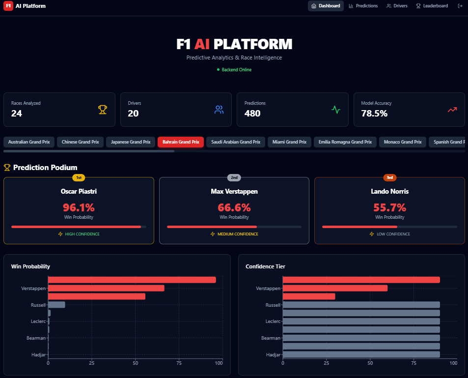

# Formula 1 Race Prediction Platform

An end-to-end Formula 1 analytics platform for **data ingestion**, **feature engineering**, **machine learning model training**, and **real-time race prediction delivery** via a FastAPI backend and React frontend.

---

## Table of Contents

- [Overview](#overview)
- [Architecture](#architecture)
- [Tech Stack](#tech-stack)
- [Repository Structure](#repository-structure)
- [Core Features](#core-features)
- [Getting Started](#getting-started)
  - [Prerequisites](#prerequisites)
  - [Environment Configuration](#environment-configuration)
  - [Install Dependencies](#install-dependencies)
- [Running the Project](#running-the-project)
  - [Option A: Local Development](#option-a-local-development)
  - [Option B: Docker Compose](#option-b-docker-compose)
- [Data & ML Workflow](#data--ml-workflow)
  - [1) Ingestion](#1-ingestion)
  - [2) Processing](#2-processing)
  - [3) Feature Engineering](#3-feature-engineering)
  - [4) Training](#4-training)
  - [5) Evaluation](#5-evaluation)
- [API Guide](#api-guide)
  - [Auth Endpoints](#auth-endpoints)
  - [Prediction Endpoints](#prediction-endpoints)
  - [Health Endpoints](#health-endpoints)
- [Frontend](#frontend)
- [Testing](#testing)
- [Configuration Reference](#configuration-reference)
- [Deployment Notes](#deployment-notes)
- [Security Notes](#security-notes)
- [Troubleshooting](#troubleshooting)
- [Roadmap Ideas](#roadmap-ideas)
- [License](#license)

---

## Overview

This project is designed as a production-style F1 prediction platform:

- Ingests race and telemetry-style data from multiple motorsport data sources.
- Cleans and transforms raw data into model-ready features.
- Trains multiple model families for tasks like:
  - winner prediction (`is_winner`)
  - podium/top-3 prediction (`is_top3`)
  - points prediction (`points`)
- Serves predictions through authenticated API endpoints.
- Provides a modern web frontend for dashboards and race insights.

---

## Architecture

High-level flow:

1. **Data ingestion** (`src/ingestion/*`) pulls raw F1 data.
2. **Processing + feature engineering** (`src/processing`, `src/features`) creates training datasets.
3. **Model training/evaluation** (`src/models`) generates artifacts and metrics.
4. **Prediction service** (`src/services/prediction_service.py`) loads models and performs inference.
5. **FastAPI app** (`src/api`) exposes auth/data/prediction/health endpoints.
6. **React frontend** (`src/frontend`) consumes API and renders analytics UI.

---

## Tech Stack

### Backend
- Python 3.11+
- FastAPI + Uvicorn
- Pydantic
- SQLAlchemy

### ML & Data
- Pandas / NumPy
- Scikit-learn
- XGBoost

### Frontend
- React + TypeScript + Vite
- TailwindCSS
- 3D/visual components under `src/frontend/src/components/three`

### Infrastructure
- Docker + Docker Compose
- Nginx
- Redis (optional profile)

---

## Repository Structure

```text
formula1-race-prediction-project/
├── app/
│   └── streamlit_app.py              # Phase 1 monitoring (legacy)
├── artifacts/
│   ├── models/                       # Serialized ML models
│   └── metrics/                      # Evaluation reports
├── config/
│   └── settings.yaml                 # Unified configuration
├── data/
│   ├── raw/
│   └── processed/
├── notebooks/
│   ├── 01_eda.ipynb                 # Exploratory analysis
│   ├── 02_feature_analysis.ipynb    # Feature validation
│   ├── 03_model_experiments.ipynb   # Model training
│   ├── 04_prediction_analysis.ipynb # Prediction review
│   └── 05_model_explainability.ipynb # SHAP analysis
├── sql/
│   └── schema_postgres.sql           # Database schema + RLS
├── src/
│   ├── api/
│   │   ├── main.py                   # FastAPI application
│   │   ├── middleware.py             # Logging & rate limiting
│   │   └── routes/
│   │       ├── auth.py              # JWT authentication
│   │       ├── predictions.py       # Prediction endpoints
│   │       ├── data.py              # Data endpoints
│   │       └── health.py            # Health checks
│   ├── frontend/                     # React 3D Application
│   │   ├── package.json
│   │   ├── vite.config.ts
│   │   ├── tailwind.config.js
│   │   ├── Dockerfile
│   │   └── src/
│   │       ├── main.tsx
│   │       ├── App.tsx
│   │       ├── index.css
│   │       ├── lib/
│   │       │   └── api.ts           # API client
│   │       ├── components/
│   │       │   ├── Layout.tsx
│   │       │   ├── Navigation.tsx
│   │       │   ├── three/
│   │       │   │   ├── F1Car.tsx
│   │       │   │   ├── DriverCard.tsx
│   │       │   │   ├── PodiumScene.tsx
│   │       │   │   └── BackgroundEffect.tsx
│   │       │   └── charts/
│   │       │       └── PredictionChart.tsx
│   │       └── pages/
│   │           ├── Dashboard.tsx
│   │           ├── Login.tsx
│   │           ├── RacePredictions.tsx
│   │           ├── DriverAnalysis.tsx
│   │           └── Leaderboard.tsx
│   ├── ingestion/
│   │   ├── base.py
│   │   ├── ingest_ergast.py
│   │   ├── ingest_openf1.py
│   │   └── ingest_fastf1.py
│   ├── models/
│   │   ├── train.py                 # ML training pipeline
│   │   └── evaluate.py              # Model evaluation
│   ├── processing/
│   │   └── clean_data.py
│   ├── features/
│   │   └── build_features.py
│   ├── services/
│   │   └── prediction_service.py    # Inference engine
│   ├── utils/
│   │   ├── config.py
│   │   ├── db.py
│   │   ├── io_utils.py
│   │   ├── logger.py
│   │   └── security.py              # JWT & API key auth
│   └── validation/
│       └── __init__.py
├── tests/
│   ├── test_config.py
│   ├── test_ingestion.py
│   ├── test_processing.py
│   ├── test_features.py
│   ├── test_api.py                  # API endpoint tests
│   └── test_security.py             # Auth tests
├── .github/
│   └── workflows/
│       └── ci-cd.yml                # GitHub Actions
├── nginx.conf                       # Reverse proxy config
├── docker-compose.yml               # Full stack orchestration
├── Dockerfile                       # API container
├── requirements.txt
├── .env.example
├── .dockerignore
└── README.md
```

---

## Core Features

- Multi-source ingestion pipeline (Ergast/Jolpi, OpenF1, FastF1).
- Config-driven ML experiments with baseline and advanced models.
- JWT-based auth flow with refresh tokens.
- Prediction endpoints for individual drivers and full-race leaderboards.
- Health/liveness/readiness endpoints for operations and orchestration.
- Local + containerized execution paths.

---

## Architecture

High-level flow:

1. **Data ingestion** (`src/ingestion/*`) pulls raw F1 data.
2. **Processing + feature engineering** (`src/processing`, `src/features`) creates training datasets.
3. **Model training/evaluation** (`src/models`) generates artifacts and metrics.
4. **Prediction service** (`src/services/prediction_service.py`) loads models and performs inference.
5. **FastAPI app** (`src/api`) exposes auth/data/prediction/health endpoints.
6. **React frontend** (`src/frontend`) consumes API and renders analytics UI.

---

## Data Pipeline

The platform implements a **layered data architecture** with strict separation between raw, processed, and feature data. All transformations are deterministic, reproducible, and time-aware to prevent data leakage.

---

```
┌─────────────────────────────────────────────────────────────────────────┐
│                         DATA SOURCES                                    │
│  ┌─────────────┐  ┌─────────────┐  ┌─────────────────────────────────┐ │
│  │ Ergast API  │  │ OpenF1 API  │  │ FastF1 Python Library           │ │
│  │ (2021-2025) │  │ (2026 Live) │  │ (Telemetry, Weather, Sessions)  │ │
│  └──────┬──────┘  └──────┬──────┘  └─────────────┬───────────────────┘ │
│         └──────────────────┴───────────────────────┘                      │
└─────────────────────────────────────────────────────────────────────────┘
↓
┌─────────────────────────────────────────────────────────────────────────┐
│                      INGESTION LAYER (src/ingestion/)                   │
│                                                                         │
│  • ErgastIngestor    — Paginated API fetching with exponential backoff  │
│  • OpenF1Ingestor    — Rate-limited requests, circuit breaker pattern   │
│  • FastF1Ingestor    — Library wrapper with local caching               │
│                                                                         │
│  Outputs: data/raw/{source}/{timestamp}.parquet                         │
│  Schema validation, idempotency checks, structured logging per batch    │
└─────────────────────────────────────────────────────────────────────────┘
↓
┌─────────────────────────────────────────────────────────────────────────┐
│                      PROCESSING LAYER (src/processing/)                 │
│                                                                         │
│  DataCleaner responsibilities:                                          │
│  • Schema normalization (column names, dtypes, UTC timestamps)          │
│  • Key reconciliation (source IDs → canonical DB IDs)                   │
│  • Lap time standardization → milliseconds                              │
│  • Duplicate removal via composite keys                                 │
│  • Missing value imputation (numeric: median/group; categorical: Unknown)│
│                                                                         │
│  Outputs: data/processed/{entity}.parquet + validation reports          │
└─────────────────────────────────────────────────────────────────────────┘
↓
┌─────────────────────────────────────────────────────────────────────────┐
│                   FEATURE ENGINEERING (src/features/)                   │
│                                                                         │
│  FeatureBuilder — anti-leakage guarantee:                               │
│  • Rolling windows computed ONLY from races before target date          │
│  • Driver performance index (points × finish × consistency)             │
│  • Constructor strength (team reliability, dual-car scoring)            │
│  • Track-specific history (experience, best finish, average points)     │
│  • Qualifying impact (gap to pole, grid gain potential)                 │
│  • DNF probability (mechanical vs crash trends)                         │
│                                                                         │
│  Outputs: PostgreSQL driver_race_features table + artifacts/            │
└─────────────────────────────────────────────────────────────────────────┘
↓
┌─────────────────────────────────────────────────────────────────────────┐
│                      STORAGE ARCHITECTURE                               │
│                                                                         │
│  ┌─────────────────────┐  ┌──────────────────────────────────────────┐ │
│  │  RAW LAYER          │  │  RELATIONAL LAYER (Supabase PostgreSQL)  │ │
│  │  data/raw/          │  │  • races, drivers, constructors          │ │
│  │  Parquet (zstd)     │  │  • results, lap_times, pit_stops         │ │
│  │  Immutable, append  │  │  • qualifying, telemetry_summary         │ │
│  │  Partitioned by     │  │  • driver_race_features (ML features)    │ │
│  │  source + date      │  │  • pipeline_runs (audit/lineage)         │ │
│  └─────────────────────┘  └──────────────────────────────────────────┘ │
│                                                                         │
│  Design principles:                                                     │
│  • Telemetry-heavy data stays in Parquet (not DB)                      │
│  • PostgreSQL handles structured, query-heavy analytical data            │
│  • RLS policies on feature tables for multi-tenant access                │
│  • Audit timestamps on all tables (created_at, updated_at)               │
│  • Alembic-ready structure for future migrations                         │
└─────────────────────────────────────────────────────────────────────────┘
↓
┌─────────────────────────────────────────────────────────────────────────┐
│                      DATA ACCESS PATTERNS                               │
│                                                                         │
│  ┌────────────────────────────────────────────────────────────────────┐ │
│  │  API Layer (src/api/routes/data.py)                                │ │
│  │  • /data/drivers        — list/filter by season                    │ │
│  │  • /data/races          — season calendar with circuit info        │ │
│  │  • /data/constructors   — team listings                            │ │
│  │  • /data/standings/{year} — championship tables                    │ │
│  └────────────────────────────────────────────────────────────────────┘ │
│                                                                         │
│  ┌────────────────────────────────────────────────────────────────────┐ │
│  │  ML Service (src/services/prediction_service.py)                   │ │
│  │  • Loads pre-trained models from artifacts/models/                 │ │
│  │  • Fetches features via SQL (time-bounded, no leakage)             │ │
│  │  • Scales features, generates predictions + confidence tiers       │ │
│  │  • Returns structured response with feature contributions          │ │
│  └────────────────────────────────────────────────────────────────────┘ │
│                                                                         │
│  ┌────────────────────────────────────────────────────────────────────┐ │
│  │  Notebooks (notebooks/) — Read-only analytical access              │ │
│  │  • 01_eda.ipynb — Season distributions, geography, trends          │ │
│  │  • 02_feature_analysis.ipynb — Correlation, leakage checks         │ │
│  │  • 03_model_experiments.ipynb — Training, comparison, selection    │ │
│  │  • 04_prediction_analysis.ipynb — Race-level prediction review     │ │
│  │  • 05_model_explainability.ipynb — SHAP values, interpretation     │ │
│  └────────────────────────────────────────────────────────────────────┘ │
└─────────────────────────────────────────────────────────────────────────┘
```
---

### Ingestion Layer

Three independent ingestors implement the `BaseIngestor` interface:

```
| Ingestor | Source | Data | Frequency | Key Features |
|----------|--------|------|-----------|--------------|
| `ErgastIngestor` | Ergast API | Historical results (2021-2025) | Batch (seasonal) | Auto-pagination, rate limiting, retry with exponential backoff |
| `OpenF1Ingestor` | OpenF1 API | Live session data (2026) | Real-time / per-session | Circuit breaker, 5-retry policy, streaming-ready hooks |
| `FastF1Ingestor` | FastF1 lib | Lap times, weather, telemetry | Per-race | Local caching, deterministic loading, session types (R/Q/FP) |

```

All ingestors produce:
- **Parquet files** in `data/raw/{source}/` with zstd compression
- **Structured logs** with record counts, validation status, file paths
- **Idempotent loads** — same data re-ingested produces identical files

### Processing Layer

The `DataCleaner` enforces:

1. **Schema normalization** — canonical column names, Pydantic-validated types, UTC timestamps
2. **Key reconciliation** — maps source identifiers (e.g., `driver_ref`) to database primary keys
3. **Time standardization** — all lap times converted to milliseconds; race dates normalized to UTC
4. **Deduplication** — composite key-based (`year`, `round`, `driver_id`) with `keep='last'`
5. **Imputation** — numeric via group median (grouped by year/round/driver), categorical as `"Unknown"`

Each run generates a **validation report** with null percentages, type checks, and row counts.

### Feature Engineering Layer

The `FeatureBuilder` guarantees **zero data leakage** through strict temporal boundaries:

For race R on date D:
Historical data = all races where date < D
Rolling features = computed from historical data only
Target variables = derived from race R results (not used in features)

---

Feature categories:

```

| Category | Features | Window |
|----------|----------|--------|
| Driver rolling | `rolling_avg_points_5r`, `rolling_avg_finish_pos_5r`, `rolling_points_trend` | Last 5 races |
| Recent form | `recent_form_points`, `recent_form_finish_pos`, `recent_form_quali_pos` | Last 3 races |
| Constructor | `constructor_avg_points_5r`, `constructor_reliability_score` | Last 5 races (team aggregate) |
| Track-specific | `track_avg_points`, `track_best_finish_pos`, `track_experience_races` | All time at circuit |
| Qualifying | `quali_position`, `quali_gap_to_pole_ms`, `grid_position_gain_potential` | Current race only |
| Reliability | `dnf_probability`, `consecutive_finishes`, `mechanical_dnf_rate` | Historical trend |
| Composite | `driver_performance_index`, `constructor_performance_index`, `overall_strength_index` | Weighted combinations |

```

Features are stored in PostgreSQL with `UNIQUE(race_id, driver_id)` constraint and RLS policies.

### Storage Architecture

```

| Layer | Format | Location | Purpose |
|-------|--------|----------|---------|
| Raw | Parquet (zstd) | `data/raw/{source}/` | Immutable ingestion archive |
| Processed | Parquet (zstd) | `data/processed/` | Cleaned, deduplicated data |
| Features | PostgreSQL | `driver_race_features` table | ML-ready, query-optimized |
| Models | Pickle (.pkl) | `artifacts/models/` | Serialized estimators + scalers |
| Metrics | JSON | `artifacts/metrics/` | Evaluation reports, feature importance |

``` 

**PostgreSQL Schema** (`sql/schema_postgres.sql`):

- Normalized tables: `circuits`, `constructors`, `drivers`, `races`, `results`, `lap_times`, `pit_stops`, `qualifying`
- Feature table: `driver_race_features` (25+ engineered columns)
- Audit table: `pipeline_runs` (UUID, timestamps, record counts, error tracking)
- Views: `v_driver_standings`, `v_constructor_standings` for quick analytics
- Triggers: Auto-update `updated_at` on all transactional tables
- RLS: Row-level security enabled on feature tables with public/service-role separation

### Data Access Patterns

```

| Consumer | Method | Path |
|----------|--------|------|
| ML Training | SQLAlchemy + pandas | `SELECT ... FROM driver_race_features JOIN races` |
| API Endpoints | SQLAlchemy sessions | Parameterized queries via `src/utils/db.py` |
| Notebooks | Direct SQL + pandas | `db.execute_dataframe(query)` |
| Frontend | HTTP/REST | FastAPI → PostgreSQL (never direct DB access) |

``` 

All database access is centralized in `src/utils/db.py` with:
- Connection pooling (QueuePool, 10-20 connections)
- SSL mode required
- Parameterized queries only (SQL injection prevention)
- Auto-commit/rollback with context managers

---


## Getting Started

### Prerequisites

- Python 3.11 or newer
- Node.js 18+ and npm (for frontend)
- Docker + Docker Compose (optional, for container flow)
- PostgreSQL-compatible database credentials (Supabase pooler is configured by default in `settings.yaml`)

### Environment Configuration

1. Copy environment template:

```bash
cp .env.example .env
```

2. Fill required values in `.env` (at minimum):

- `DB_PASSWORD`
- `JWT_SECRET_KEY`
- `API_KEY` (if used in your flow)
- optional overrides such as `API_BASE_URL`, `REDIS_URL`, `LOG_LEVEL`

### Install Dependencies

```bash
python -m venv venv
source venv/bin/activate
pip install -r requirements.txt
```

Frontend dependencies:

```bash
cd src/frontend
npm install
cd ../..
```

---

## Running the Project

### Option A: Local Development

You can use the helper script:

```bash
chmod +x scripts/run_local.sh
./scripts/run_local.sh
```

What it does:

1. Loads `.env`.
2. Tests DB connection.
3. Checks schema/data presence.
4. Triggers quick model training if artifacts are missing.
5. Starts FastAPI on `http://localhost:8000`.

To run frontend separately:

```bash
cd src/frontend
npm run dev
```

### Option B: Docker Compose

Start full stack:

```bash
docker compose up --build
```

Services exposed:

- API: `http://localhost:8000`
- Frontend: `http://localhost:3000`
- Nginx reverse proxy: `http://localhost`
- Redis (if enabled): `localhost:6379`

To include optional Redis profile:

```bash
docker compose --profile with-redis up --build
```

---

## Data & ML Workflow

### 1) Ingestion

Modules:

- `src/ingestion/ingest_ergast.py`
- `src/ingestion/ingest_openf1.py`
- `src/ingestion/ingest_fastf1.py`

Typical execution:

```bash
python -m src.ingestion.ingest_ergast
python -m src.ingestion.ingest_openf1
python -m src.ingestion.ingest_fastf1
```

### 2) Processing

```bash
python -m src.processing.clean_data
```

### 3) Feature Engineering

```bash
python -m src.features.build_features
```

### 4) Training

```bash
python -m src.models.train
```

### 5) Evaluation

```bash
python -m src.models.evaluate
```

Generated outputs:

- model binaries under `artifacts/models`
- metric reports under `artifacts/metrics`

---

## API Guide

FastAPI app entrypoint: `src/api/main.py`.

Interactive docs (non-production mode):

- Swagger UI: `http://localhost:8000/docs`
- ReDoc: `http://localhost:8000/redoc`

### Auth Endpoints

Base prefix: `/auth`

- `POST /auth/login` → returns access + refresh tokens.
- `POST /auth/refresh` → refreshes access token.
- `GET /auth/me` → returns current authenticated user context.
- `POST /auth/logout` → logout placeholder endpoint.

> Note: Current login route supports development-friendly behavior; tighten for production.

### Prediction Endpoints

Base prefix: `/predict`

- `POST /predict/driver`
  - Query params: `race_id`, `driver_id`, `model_type`, `target`
  - Returns prediction for one driver.
- `GET /predict/race/{race_id}`
  - Returns prediction set for a full race.
- `GET /predict/leaderboard/{race_id}`
  - Returns top-3 style leaderboard from race predictions.

### Health Endpoints

Base prefix: `/health`

- `GET /health/` → overall status response.
- `GET /health/live` → liveness probe.
- `GET /health/ready` → readiness with DB connectivity check.
- `GET /health/metrics` → placeholder operational metrics.

---

## Frontend

Frontend source: `src/frontend`.

Run in development mode:

```bash
cd src/frontend
npm run dev
```

Build for production:

```bash
npm run build
```

Core pages include:

- Dashboard
- Race Predictions
- Driver Analysis
- Leaderboard
- Login

---

## Testing

Run all tests:

```bash
pytest -q
```

Or run selected suites:

```bash
pytest tests/test_api.py -q
pytest tests/test_security.py -q
pytest tests/test_ingestion.py -q
```

---

## Configuration Reference

Primary config file: `config/settings.yaml`.

Major sections:

- `database`: DB host/user/pool settings.
- `api`: host/port/CORS/rate-limits/JWT settings.
- `ml`: model directories, targets, algorithms, hyperparameters.
- `ingestion`: per-source retry/timeout/rate-limit tuning.
- `storage`: raw/processed paths and serialization format.
- `processing`: null/duplication/timezone strategies.
- `features`: rolling/form windows.
- `logging`: level/format/retention.
- `security`: masking and query guardrails.

---

## Deployment Notes

- `Dockerfile` contains API production image stages.
- `docker-compose.yml` provides local multi-service orchestration.
- `nginx.conf` can be used for reverse proxying API/frontend.
- `render.yaml` and `vercel.json` indicate cloud deployment targets.

---

## Security Notes

Before production rollout:

- Replace development-friendly auth acceptance in `src/api/routes/auth.py` with strict credential validation.
- Ensure strong, rotated `JWT_SECRET_KEY` and DB credentials.
- Restrict CORS origins to trusted domains only.
- Keep rate limiting enabled and tuned.
- Apply schema + row-level-security policies from `sql/schema_postgres.sql`.

---

## Troubleshooting

- **`/health/ready` returns not ready**: verify DB credentials in `.env` and network access.
- **Prediction endpoint returns service unavailable**: ensure model artifacts exist and prediction service initializes correctly.
- **Frontend cannot reach backend**: verify `VITE_API_URL` and CORS config.
- **Docker startup issues**: inspect service logs with `docker compose logs -f api frontend`.

---

## Roadmap Ideas

- Add experiment tracking (MLflow / Weights & Biases).
- Add drift detection and automated retraining schedule.
- Add richer observability (Prometheus/Grafana/OpenTelemetry).
- Add role-based authorization beyond current basic role checks.
- Add CI gates for model quality thresholds.

---

## License

No license file is currently included in this repository.
